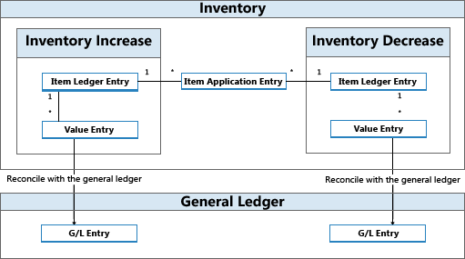

# Designdetails: BestandsbuchungDesign Details: Inventory Posting
Jede Bestandstransaktion, wie etwa eine Einkaufslieferung oder eine Verkaufslieferung, bucht zwei Posten unterschiedlichen Typs.Each inventory transaction, such as a purchase receipt or a sales shipment, posts two entries of different types.  

|PostenartEntry type|DescriptionDescription|  
|----------------|---------------------------------------|  
|MengeQuantity|Spiegelt die Menge im Bestand wider.Reflects the change of quantity in inventory. Diese Informationen werden in Lagerposten gespeichert.This information is stored in item ledger entries.   Begleitet von den Artikelausgleichsposten.Accompanied by item application entries.|  
|WertValue|Spiegelt die Änderung des Lagerwerts wider.Reflects the change of inventory value. Diese Informationen werden in Wertposten gespeichert.This information is stored in value entries.   Pro Lagerposten und pro Kapazitätsposten kann es einen oder mehrere Wertposten geben.One or more value entries can exist for each item ledger entry or capacity ledger entry.   Informationen zu Kapazitätswertposten, die sich auf die Verwendung der Produktions- oder Montageressourcen beziehen, finden Sie unter [Designdetails: Produktionsauftragsbuchung](design-details-production-order-posting.md) .For information about capacity value entries related to the use of production or assembly resources, see [Design Details: Production Order Posting](design-details-production-order-posting.md).|  

 In Verbindung mit Mengenbuchungen gibt es Artikelausgleichsposten, um die Bestandserhöhung mit der Bestandsminderung zu verknüpfen.In relation to quantity postings, item application entries exist to link inventory increase with inventory decrease. Dies ermöglicht dem Kalkulationsmodul, Kosten für Lagerzu- an die entsprechenden Abgänge weiterzuleiten und umgekehrt.This enables the costing engine to forward costs from increases to the related decreases and vice versa. [Weitere Informationen finden Sie unter "Designdetails: Artikelverfolgung".](design-details-item-application.md)For more information, see [Design Details: Item Application](design-details-item-application.md).  

 Lagerposten, Wertposten und Artikelausgleichsposten werden durch eine Artikel Erf.-Journalzeile erstellt, entweder indirekt durch Buchen einer Auftragszeile oder direkt im Fenster Artikel Erf.-Journal.Item ledger entries, value entries, and item application entries are created as a result of posting an item journal line, either indirectly by posting an order line or directly in the Item Journal window.  

 In regelmäßigen dynamischen Abständen werden Wertposten, die im Bestandsposten erstellt werden, ins Hauptbuch gebucht, um die beiden Bücher aus Finanzkontrollgründen abzugleichen.At regular intervals, value entries that are created in the inventory ledger are posted to the general ledger to reconcile the two ledgers for financial control reasons. Weitere Informationen finden Sie unter [Designdetails: Abstimmung mit der Fibu](design-details-reconciliation-with-the-general-ledger.md).For more information, see [Design Details: Reconciliation with the General Ledger](design-details-reconciliation-with-the-general-ledger.md).  

   

## BeispielExample  
 Im folgenden Beispiel wird veranschaulicht, wie Lagerposten, Wertposten und Artikelausgleichsposten zu Fibuposten führen.The following example shows how item ledger entries, value entries, and item application entries result in general ledger entries.  

 Sie buchen eine Einkaufsbestellung als erhalten und fakturiert für 10 Artikel mit einem EK-Preis von MW 7 und einem Gemeinkostensatz von MW 1.You post a purchase order as received and invoiced for 10 items with a direct unit cost of LCY 7 and an overhead rate of LCY 1. Das Buchungsdatum ist 01-01-20.The posting date is 01-01-20. Die folgenden Einträge werden folgendermaßen erzeugt:The following entries are created.  

 **Lagerposten****Item Ledger Entries**  

|BuchungsdatumPosting Date|PostentypEntry Type|Einstandsbetrag (tatsächl.)Cost Amount (Actual)|MengeQuantity|Laufnr.Entry No.|  
|------------------|----------------|----------------------------|--------------|---------------|  
|01-01-2001-01-20|EinkaufPurchase|80.0080.00|1010|11|  

 **Wertposten****Value Entries**  

|BuchungsdatumPosting Date|PostentypEntry Type|Einstandsbetrag (tatsächl.)Cost Amount (Actual)|Lagerposten Laufnr.Item Ledger Entry No.|Laufnr.Entry No.|  
|------------------|----------------|----------------------------|---------------------------|---------------|  
|01-01-2001-01-20|EK-PreisDirect Cost|70.0070.00|11|11|  
|01-01-2001-01-20|KostenIndirect Cost|10,0010.00|11|22|  

 **Artikelausgleichsposten****Item Application Entries**  

|Laufnr.Entry No.|Lagerposten Laufnr.Item Ledger Entry No.|Eingeh. Lagerposten Laufnr.Inbound Item Entry No.|Ausgeh. Lagerposten Laufnr.Outbound Item Entry No.|MengeQuantity|  
|---------------|---------------------------|----------------------------|-----------------------------|--------------|  
|11|11|11|00|1010|  

 Als nächsten Schritt buchen Sie einen Verkauf mit 10 Stück des Artikels mit einem Buchungsdatum aus 01-15-20.Next, you post a sale of 10 units of the item with a posting date of 01-15-20.  

 **Lagerposten****Item Ledger Entries**  

|BuchungsdatumPosting Date|PostentypEntry Type|Einstandsbetrag (tatsächl.)Cost Amount (Actual)||MengeQuantity|Laufnr.Entry No.|  
|------------------|----------------|----------------------------|-|--------------|---------------|  
|01-15-2001-15-20|VerkaufSale|-80.00-80.00||-10-10|22|  

 **Wertposten****Value Entries**  

|BuchungsdatumPosting Date|PostentypEntry Type|Einstandsbetrag (tatsächl.)Cost Amount (Actual)|Lagerposten Laufnr.Item Ledger Entry No.|Laufnr.Entry No.|  
|------------------|----------------|----------------------------|---------------------------|---------------|  
|01-15-2001-15-20|EK-PreisDirect Cost|-80.00-80.00|22|33|  

 **Artikelausgleichsposten****Item Application Entries**  

|Laufnr.Entry No.|Lagerposten Laufnr.Item Ledger Entry No.|Eingeh. Lagerposten Laufnr.Inbound Item Entry No.|Ausgeh. Lagerposten Laufnr.Outbound Item Entry No.|MengeQuantity|  
|---------------|---------------------------|----------------------------|-----------------------------|--------------|  
|22|22|01|22|-10-10|  

 Am Ende der Buchhaltungsperiode führen Sie die Stapelverarbeitung **Lagerreg. buchen** aus, um diese Lagertransaktionen mit der Fibu abzustimmen.At the end of the accounting period, you run the **Post Inventory Cost to G/L** batch job to reconcile these inventory transactions with the general ledger.  

 Weitere Informationen finden Sie unter [Designdetails: Konten in der Fibu](design-details-accounts-in-the-general-ledger.md).For more information, see [Design Details: Accounts in the General Ledger](design-details-accounts-in-the-general-ledger.md).  

 Die folgenden Tabellen zeigen das Ergebnis der Abstimmung der Lagertransaktionen in diesem Beispiel mit der Finanzbuchhaltung.The following tables show the result of reconciling the inventory transactions in this example with the general ledger.  

 **Wertposten****Value Entries**  

|BuchungsdatumPosting Date|PostentypEntry Type|Einstandsbetrag (tatsächl.)Cost Amount (Actual)|Gebuchte Lagerregulierung an G/LCost Posted to G/L|Lagerposten Laufnr.Item Ledger Entry No.|Laufnr.Entry No.|  
|------------------|----------------|----------------------------|-------------------------|---------------------------|---------------|  
|01-01-2001-01-20|EK-PreisDirect Cost|70.0070.00|70.0070.00|11|11|  
|01-01-2001-01-20|KostenIndirect Cost|10,0010.00|10,0010.00|11|22|  
|01-15-2001-15-20|EK-PreisDirect Cost|-80.00-80.00|-80.00-80.00|22|33|  

 **Sachposten****General Ledger Entries**  

|BuchungsdatumPosting Date|FibukontoG/L Account|Kontonr. (En-US-Demo)Account No. (En-US Demo)||BetragAmount|Laufnr.Entry No.|  
|------------------|------------------|---------------------------------|-|------------|---------------|  
|01-01-2001-01-20|[Lagerkonto][Inventory Account]|21302130||70.0070.00|11|  
|01-01-2001-01-20|[Direkte Kosten Verrech.-Konto][Direct Cost Applied Account]|72917291||-70.00-70.00|22|  
|01-01-2001-01-20|[Lagerkonto][Inventory Account]|21302130||10,0010.00|33|  
|01.01.0701-01-07|[Gemeinkostenverrechnungskonto][Overhead Applied Account]|72927292||-10.00-10.00|44|  
|01-15-2001-15-20|[Lagerkonto][Inventory Account]|21302130||-80.00-80.00|55|  
|01-15-2001-15-20|[COGS-Konto][COGS Account]|72907290||80.0080.00|66|  

> [!NOTE]  
>  Das Buchungsdatum der Sachposten ist das gleiche wie für die zugehörigen Wertposten.The posting date of the general ledger entries is the same as for the related value entries.  
>   
>  Das Feld Im S**achbuch gebuchte Kosten** in der Tabelle **Wertposten** wird ausgefüllt.The **Cost Posted to G/L** field in the **Value Entry** table is filled.  

 Die Beziehung zwischen Wertposten und Fibuposten wird in der Tabelle **Fibuposten - Lagerpostenverbindung** gespeichert.The relation between value entries and general ledger entries is stored in the **G/L - Item Ledger Relation** table.  

 **Relationsposten im Sachkonto – Tabelle Artikelpostenrelation****Relation Entries in the G/L – Item Ledger Relation table**  

|Fibuposten Laufnr.G/L Entry No.|Wertposten Lfd. Nr.Value Entry No.|Fibujournalnr.G/L Register No.|  
|--------------------|---------------------|-----------------------|  
|11|11|11|  
|22|11|11|  
|33|22|11|  
|44|22|11|  
|55|33|11|  
|66|33|11|  

## Montage- und Produktions-BuchungAssembly and Production Posting  
Kapazitäts- und Ressourcenposten repräsentieren die Zeit, die als bei Produktion oder Montage verbraucht gebucht wird.Capacity and resource ledger entries represent the time that is posted as consumed in production or assembly. Diese Prozesskosten werden als Wertposten in der Finanzbuchhaltung zusammen mit den entsprechenden Materialkosten in einer ähnlichen Struktur gebucht, wie für Lagerposten in diesem Thema beschrieben.These process costs are posted as value entries to the general ledger along with the involved material costs in a similar structure as described for item ledger entries in this topic.  

Weitere Informationen finden Sie unter [Designdetails: Montageauftragsbuchung](design-details-assembly-order-posting.md).For more information, see [Design Details: Assembly Order Posting](design-details-assembly-order-posting.md).  

## Siehe auchSee Also  
 [Designdetails: Lagerkostenberechnung](design-details-inventory-costing.md) [Design Details: Inventory Costing](design-details-inventory-costing.md)   
 [Designdetails: Konten in der Finanzbuchhaltung](design-details-accounts-in-the-general-ledger.md) [Design Details: Accounts in the General Ledger](design-details-accounts-in-the-general-ledger.md)   
 [Designdetails: Kostenkomponenten](design-details-cost-components.md) [Verwalten der Lagerkosten](finance-manage-inventory-costs.md)[Design Details: Cost Components](design-details-cost-components.md) [Managing Inventory Costs](finance-manage-inventory-costs.md)  
 [FinanzenFinance](finance.md)  
 [Arbeiten mit [!INCLUDE[d365fin](includes/d365fin_md.md)]](ui-work-product.md)[Working with [!INCLUDE[d365fin](includes/d365fin_md.md)]](ui-work-product.md)

